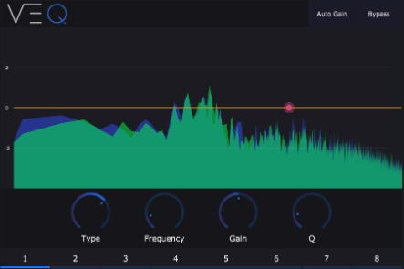

</img>

[](https://github.com/versustunez/VEQ/actions/workflows/build.yml)

</img>

The ***Eight-Band Parallel Equalizer*** feature takes an innovative approach to sound modification, where each band
processes the audio concurrently rather than in a sequential chain, offering a richer and more intricate adjustment.

In this methodology, the audio data passes through each of the eight filters simultaneously, letting them work
separately on the same audio sample. Each filter adjusts a specific frequency range, and these adjustments are then
added together, resulting in a cumulative, richer effect. Afterward, the resulting sound is normalized to avoid
excessive loudness variations and ensure a balanced output.

> To imagine how it works: think of eight band members playing the same tone, but each influencing it differently. In
> the end, we combine their influences to create a unique, harmonious tune. This ensures a more in-depth and complex
> modification, providing the precision required for creating a vibrant and balanced sound.

## Core Features

* ***Eight-Band Parallel Equalizer:*** This feature allows fine-tuning of audio by independently manipulating eight
  different frequency bands.
* ***Auto Gain:*** With the Auto Gain feature, you can ensure consistent volume levels, eliminating the need to manually
  adjust the overall volume after equalizing.
* ***Custom-Made Filter:*** Our specially crafted filter offers precision controls for enhancing the audio quality,
  providing a distinct and improved sound.

## Why This Plugin

The primary motivation behind creating this particular equalizer plugin, codenamed "VEQ", stemmed from the clear lack of
efficient and user-friendly parallel EQ plugins in the virtual domain. While there are numerous hardware alternatives
offering parallel equalization, finding a software counterpart that delivers similar functionality was challenging.

Many of the available software solutions had a steep learning curve, clunky interfaces, or a swarm of features that
often led to more confusion than utility. Performance and optimization were other critical areas where these plugins
seemed lacking. Users had to deal with slow response times and inefficiencies, which eventually meant sacrificing
creativity for technical limitations.

Moreover, the propensity to learn and explore uncharted territories led me down this unique road. I wanted to combine
technical refinement, usability and efficiency into one solution, and that's how VEQ was conceived.

Over its development phase, VEQ has grown into an effective, streamlined, and high performing parallel EQ plugin that
fills the identified gap in the music software industry, making the EQ-ing process less of a technical hurdle and more
of a fun, creative experience. The journey was a chance to engage with numerous challenges, enhancing my knowledge in
the process, transforming those challenges into opportunities for learning, which is one of the most gratifying
experiences as well.

## Build

For building you need:
- CMake `3.16 or Newer`
- Compiler (MSVC, GCC, Clang) That supports C++20

### Generic
```
mkdir build
cd build
cmake .. -DCMAKE_BUILD_TYPE={Release|Debug}
cmake --build . --config {Release|Debug}
```

> The config does not have an effect on Linux Systems, on the other hand the CMAKE_BUILD_TYPE has no effect on Windows.
